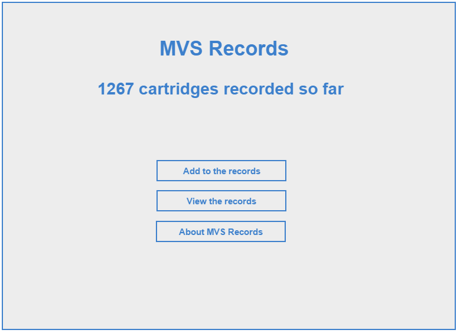
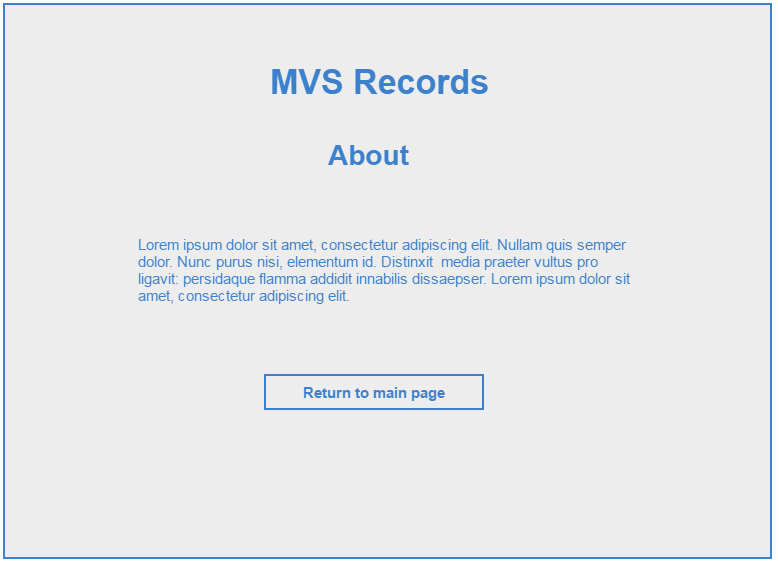
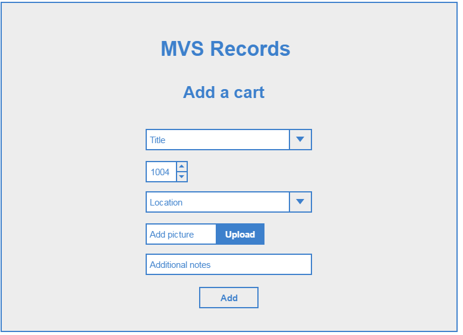
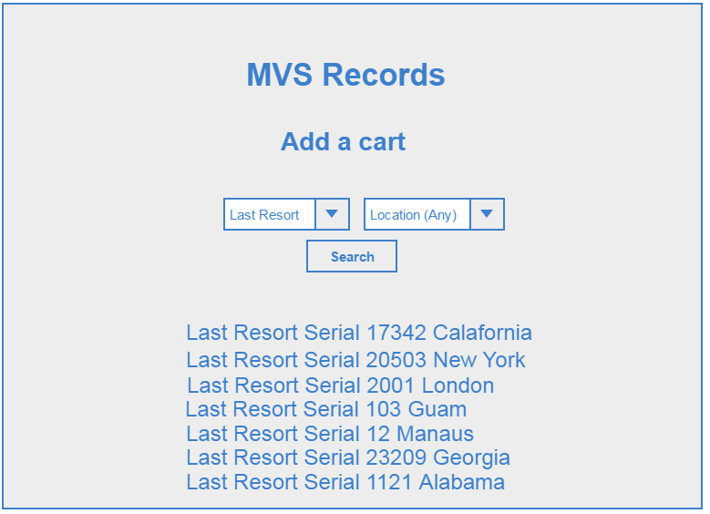

# MVS Records

## A web app that aims to facilitate the collection of information regarding the wordwide distribution of Neo Geo MVS cartridges

### Uses Node.js, Express.js, Bootstrap and Mongo DB

*Main index page. Current amount of carts in the database shown*

*About page, give more details about the site and its purpose*

*Add page. User enters a games title, serial number, location and picture. Additional notes about the cartridge can be given*

*View page. User can select a title and location and view a list of carts based on these criteria*

## Database model schema

1. Title - Text (predefined list?)
2. Serial - Number
3. Location - Country (predefined list?)
4. Pic - ??
5. Notes - Text
